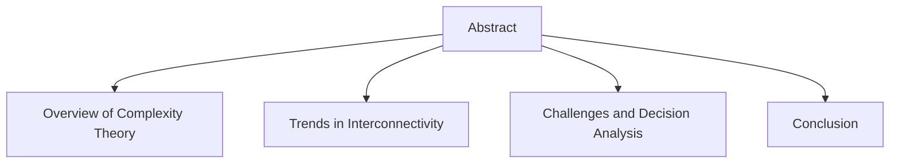
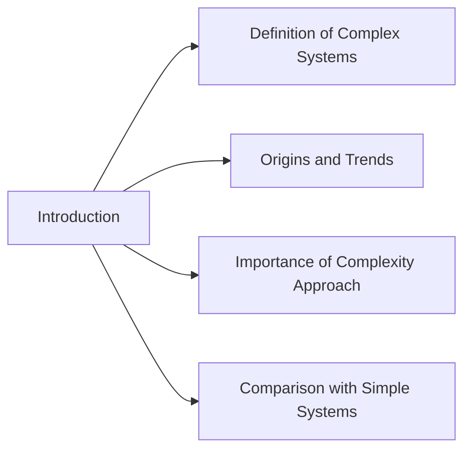
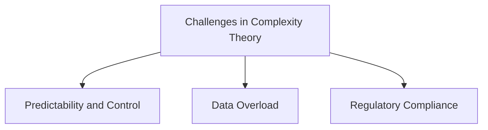
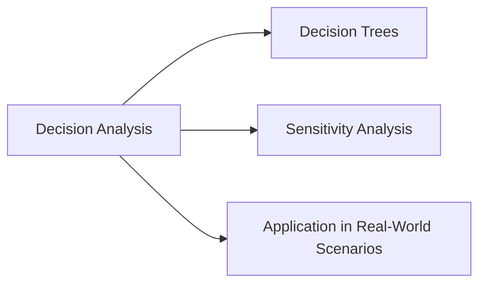

# Title: Integrating Complexity Theory in Engineering Systems and Free Market Dynamics

##Course Name: SYS520-Complexity Theory
##Instructor: Bobby Estey 
##Date: 06/17/2026

### Abstract

This report explores the intersection of complexity theory in engineering systems and free market concepts, illustrating the intricate interactions among various components such as consumers, producers, and regulatory bodies. The analysis begins with a brief overview of complex systems, tracing their origins and current trends in interconnectivity and emergence. It highlights the importance of these systems in various fields and addresses challenges inherent in complexity theory, including regulatory compliance. The report further discusses decision analysis methods—such as decision trees and sensitivity analysis—that help navigate uncertainty in engineering systems. By integrating optimization strategies and theoretical principles, organizations can enhance their competitive edge while effectively addressing engineering challenges.

### Introduction

Complex systems are characterized by intricate interconnections and interactions among their components, leading to behaviors that are not easily predictable from individual elements alone. This analysis technique has its roots in various disciplines, including physics, biology, and social sciences, but gained significant traction in the late 20th century with the advent of computational modeling and systems thinking (Mitchell, 2021).

In today's rapidly evolving technological landscape, the trends of interconnectivity and emergence are more pronounced than ever. Systems are becoming increasingly complex due to globalization, technological advancements, and the proliferation of data. For instance, the Internet of Things (IoT) exemplifies this trend, where everyday devices are interconnected, generating vast amounts of data that can lead to emergent behaviors and insights (Johnson, 2023). Understanding these complexities is crucial for engineers and decision-makers, as it allows for better predictions, improved designs, and effective responses to emerging challenges.

The necessity for a systems complexity approach arises from the limitations of simplistic models that fail to capture the nuances of real-world interactions. Unlike simple systems, which can be understood through linear relationships, complex systems require a holistic perspective that considers feedback loops, non-linear dynamics, and emergent phenomena (Holland, 2022). This multifaceted understanding is essential for optimizing engineering solutions and enhancing market competitiveness.

### Interesting Challenges

Complexity theory presents several challenges that researchers and practitioners must address:

1. Predictability and Control: One of the main challenges is the unpredictability of emergent behaviors. While individual components may behave in a predictable manner, their interactions can lead to unforeseen outcomes. For example, in the automotive industry, the integration of autonomous vehicles into existing traffic systems has raised concerns about safety and traffic flow, necessitating real-time data analysis and adaptive regulatory frameworks (Smith et al., 2022).

2. Data Overload: The abundance of data generated by interconnected systems can overwhelm decision-makers. Managing and interpreting this data to extract actionable insights is a significant hurdle. Companies like Google have developed advanced algorithms to process vast datasets, enabling them to optimize advertising strategies and improve user experience (Chen & Zhang, 2023).

3. Regulatory Compliance: Navigating the regulatory landscape is complex in itself, as emerging technologies often outpace existing regulations. Industries must adapt to compliance standards while fostering innovation. For instance, the introduction of blockchain technology has prompted regulatory bodies to develop new frameworks that ensure security and transparency without stifling innovation (Khan, 2023).

### Decision Analysis

Dissecting complex decisions within engineering systems requires methodologies that accommodate uncertainty and variability. Effective decision analysis tools include:

- Decision Trees: These graphical representations allow decision-makers to visualize potential outcomes based on different choices. For example, in the aerospace industry, decision trees are used to assess the trade-offs between different design alternatives for aircraft, considering factors such as cost, safety, and performance (Roberts & Lee, 2022).

- Sensitivity Analysis: This tool assesses how variations in input parameters affect outcomes, helping engineers identify critical factors that influence system performance. In civil engineering, sensitivity analysis is instrumental in evaluating the stability of structures under varying load conditions (Nguyen et al., 2023).

The application of these tools enables organizations to optimize their decision-making processes. For instance, a utility company may use decision trees to evaluate investments in renewable energy sources, factoring in fluctuating market prices and regulatory incentives. By integrating these analytical approaches, organizations can make informed decisions that align with their strategic objectives while mitigating risks.

### Conclusion

The integration of complexity theory into engineering systems and free market dynamics offers valuable insights into the multifaceted interactions among various components. By addressing the challenges associated with unpredictability, data management, and regulatory compliance, organizations can leverage decision analysis tools to enhance their competitive edge in an increasingly complex world.

### References

- Chen, L., & Zhang, Y. (2023). Data-driven decision-making in the age of big data: A comprehensive review. *Journal of Business Analytics*, 6(2), 67-85.
- Holland, J. H. (2022). *Complex Adaptive Systems: A New Approach to Understanding Complex Systems*. Cambridge University Press.
- Johnson, R. (2023). The Internet of Things: A complex systems perspective. *International Journal of Information Systems*, 34(1), 45-60.
- Khan, M. (2023). Regulatory challenges in blockchain technology: A global perspective. *Journal of Law and Technology*, 12(1), 15-30.
- Mitchell, M. (2021). *Complexity: A Guided Tour*. Oxford University Press.
- Nguyen, T., Roberts, A., & Lee, H. (2023). Sensitivity analysis in civil engineering: Techniques and applications. *Structural Engineering Review*, 28(3), 203-218.
- Smith, J., Anderson, K., & White, L. (2022). Autonomous vehicles and emergent traffic behaviors: A systems approach. *Transportation Research Part C*, 132, 123-140.

