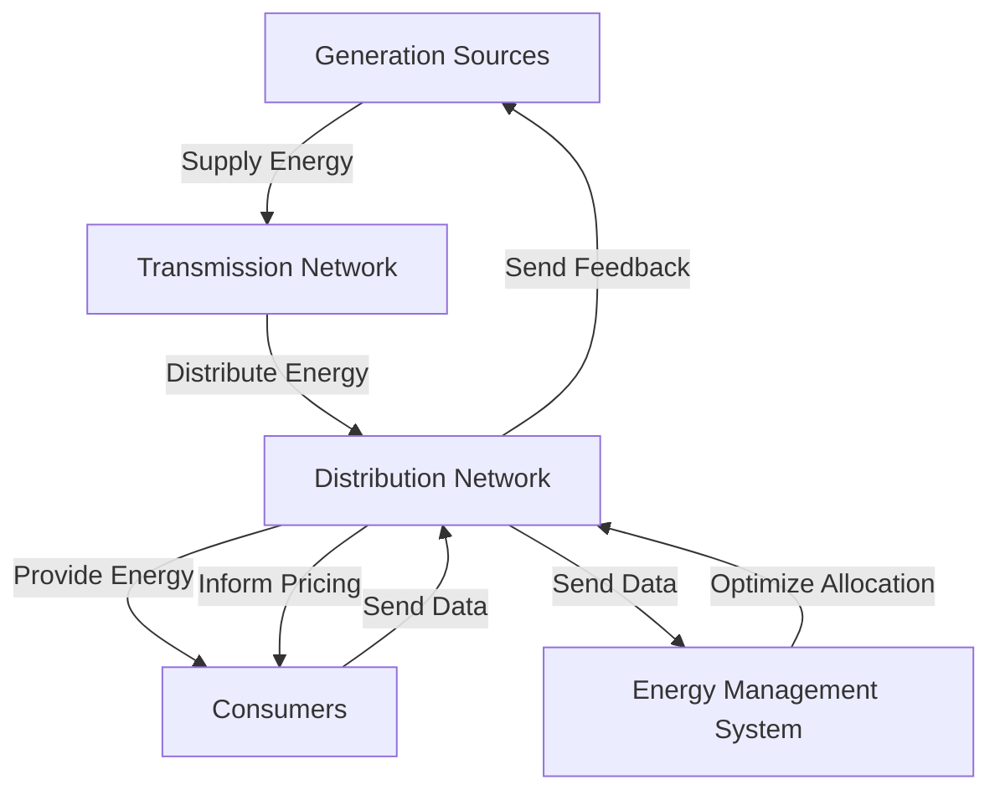
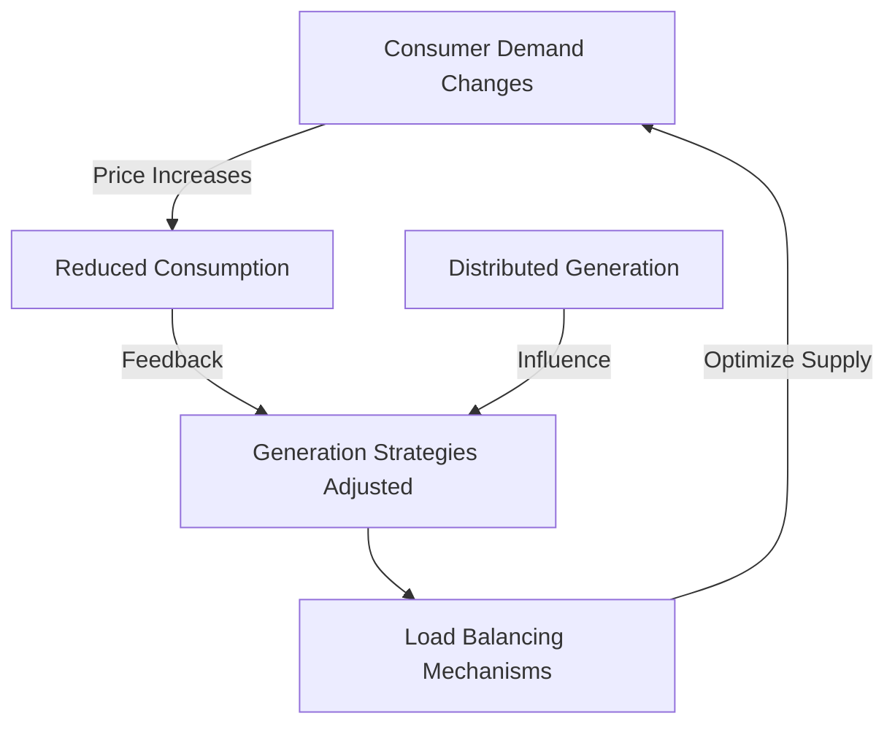
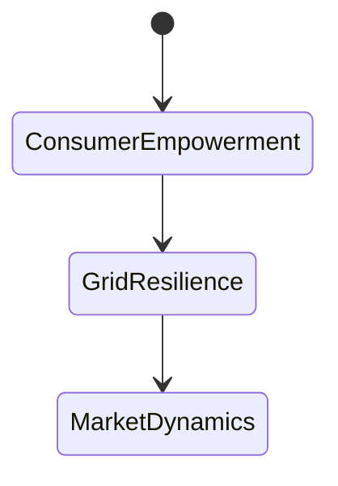
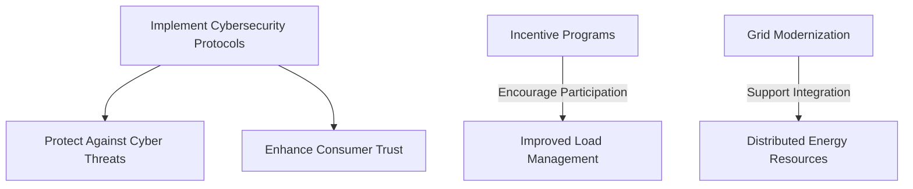
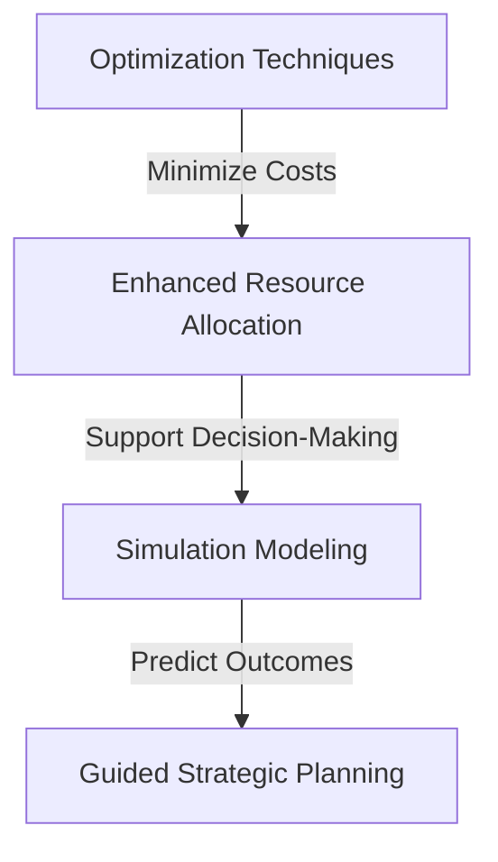
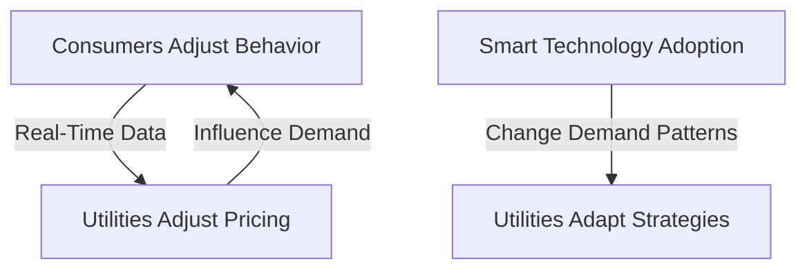
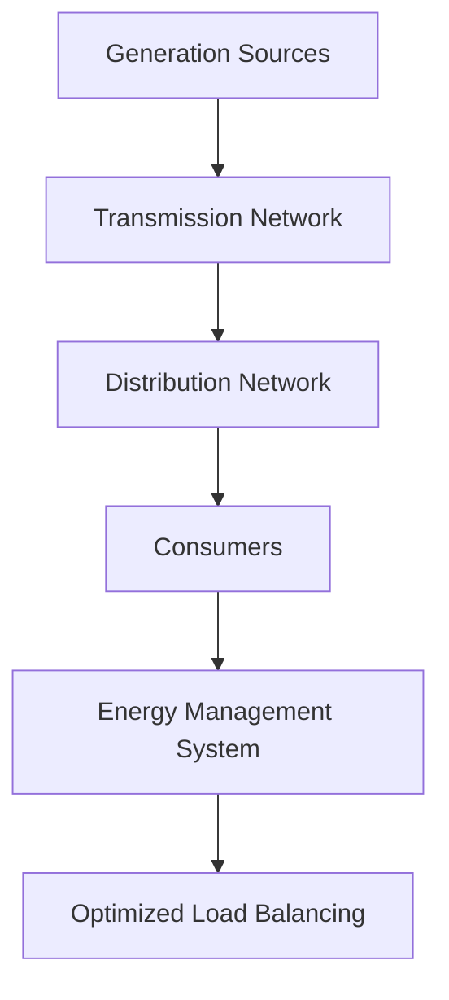
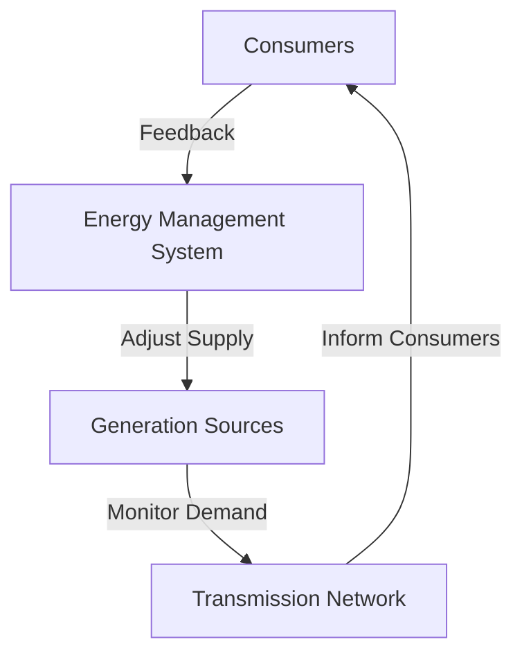
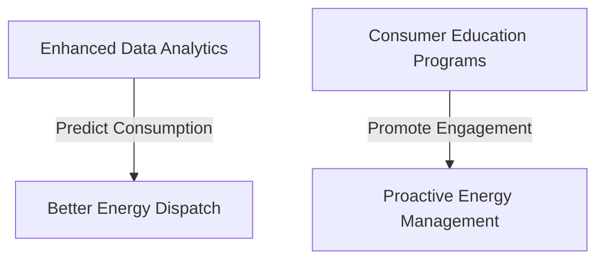
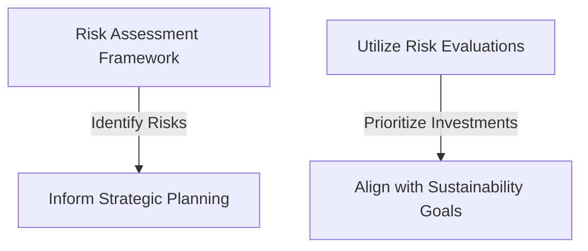

### Course Name: SYS520-Complexity Theory
### Instructor: Bobby Estey 
### Date: 06/24/2026
### Case Study: Smart Grid as a Complex Adaptive System (CAS)

#### Introduction

The smart grid signifies a revolutionary shift from traditional power systems to a more integrated and intelligent framework that enhances electricity generation, distribution, and consumption. By incorporating advanced technologies such as digital communication, automation, and renewable energy sources, the smart grid aims to create a more efficient, reliable, and sustainable energy ecosystem. This case study will analyze the smart grid as a complex adaptive system (CAS), focusing on its components, dynamics, emergent behaviors, and implications for decision-making and risk management.

#### System Components and Interactions

The smart grid comprises various components that interact in complex ways. Understanding these components is crucial for grasping the system's dynamics.

1. Components:
   - Generation Sources: Includes traditional power plants (e.g., coal, natural gas, nuclear) and renewable sources (e.g., solar, wind, hydro).
   - Transmission and Distribution Network: Infrastructure responsible for carrying electricity from generation sites to consumers.
   - Smart Meters: Devices that provide real-time data on energy consumption, allowing both consumers and utility companies to make informed decisions.
   - Energy Management Systems (EMS): Software platforms that optimize energy distribution based on current demand and supply.
   - Consumers: End-users who can adjust their energy consumption based on signals from the grid, such as real-time pricing.

2. Interactions:
   The interactions among these components are characterized by bidirectional communication and feedback loops that enhance the system's adaptability.

#### Key System Dynamics and Feedback Loops

Understanding the key dynamics and feedback loops is essential for analyzing how the smart grid operates as a CAS.

1. Demand Response: The system adjusts energy supply based on real-time demand changes influenced by consumer behavior. When prices rise, consumers may reduce their usage, which in turn affects generation strategies.

2. Distributed Generation: The increased integration of renewable energy sources, like solar panels, leads to decentralized production, causing utilities to modify their grid management strategies.

3. Load Balancing: Automated systems dynamically balance supply and demand to ensure reliability and minimize outages.

Risk Assessment:
The smart grid faces several potential hazards, including:
- Cybersecurity Threats: Vulnerabilities due to interconnected systems that can be exploited by malicious actors.
- Physical Risks: Natural disasters that may damage infrastructure, causing outages.
- Economic Risks: Fluctuations in energy prices and regulatory changes impacting profitability.

#### Analysis of Emergent Behaviors

Emergent behaviors in the smart grid showcase the system's ability to adapt and evolve.

1. Consumer Empowerment: As consumers gain access to real-time data, they become more proactive in managing their energy use, leading to sustainable practices.

2. Grid Resilience: The smart grid's self-healing capabilities allow it to quickly recover from disruptions, maintaining service continuity.

3. Market Dynamics: New markets for energy trading emerge, driven by real-time pricing and increased consumer engagement.

### Potential Interventions and Recommendations

To enhance the smart grid's adaptability, several interventions can be considered.

1. Cybersecurity Protocols: Implementing robust cybersecurity measures will protect against potential cyber threats.

2. Incentive Programs: Encouraging consumer participation in demand response initiatives through financial incentives can lead to better load management.

3. Grid Modernization: Investing in infrastructure upgrades will support the integration of more distributed energy resources.

#### Operations Research Methods

Operations research provides valuable methods for optimizing decision-making in the smart grid context.

1. Simulation Modeling: Utilizing simulations to forecast the effects of various interventions on system performance can guide strategic planning.

2. Optimization Techniques: Employing linear programming can help minimize costs and enhance resource allocation.

---

### Evaluation of Adaptation and Self-Organization

#### Adaptive Mechanisms and Interplay of System Agents

The smart grid's adaptive mechanisms are driven by the interactions among various agents within the system. This interplay is characterized by feedback loops that enable the system to respond to changes effectively.

- Adaptive Mechanisms: Agents such as consumers and utilities adjust their behaviors based on real-time data. For instance, when demand increases, utilities may raise prices, prompting consumers to reduce usage.

- Interplay of Agents: The relationship among agents is dynamic. Increased consumer adoption of smart technology can lead to shifts in energy demand patterns, necessitating adjustments by utilities.

#### Diagrams/Models Illustrating Self-Organization

1. Self-Organization Model: A network diagram illustrating the interconnectedness of generation sources, consumers, and control systems can provide a visual representation of the smart grid's structure.

2. Feedback Loop Diagram: This diagram shows the flow of information and feedback among components, illustrating how the smart grid self-organizes.

#### Proposed Enhancements for Improved Adaptability

1. Enhanced Data Analytics: Implementing advanced analytics can predict consumption patterns, allowing for better energy dispatch and resource allocation.

2. Consumer Education Programs: Educating consumers about energy usage and the benefits of smart technology can drive proactive engagement in energy management.

#### Risk Evaluation

Conducting a thorough risk evaluation is crucial for strategic decision-making in the smart grid context.

1. Risk Assessment Framework: Identifying and categorizing risks such as operational, cybersecurity, and compliance risks can inform strategic planning.

2. Strategic Decision Making: Utilizing risk evaluations to prioritize investments in technology and infrastructure can align with long-term sustainability goals.

---
### Conclusion

The smart grid exemplifies a complex adaptive system, where the interaction among various components leads to emergent behaviors that enhance efficiency and resilience. By employing operations research methods and conducting thorough risk assessments, stakeholders can make informed decisions that promote sustainability and reliability in energy distribution. Understanding the intricacies of such systems prepares professionals to navigate challenges and leverage opportunities for growth in their careers.
