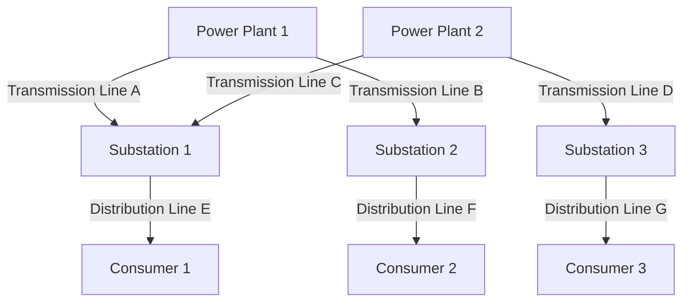
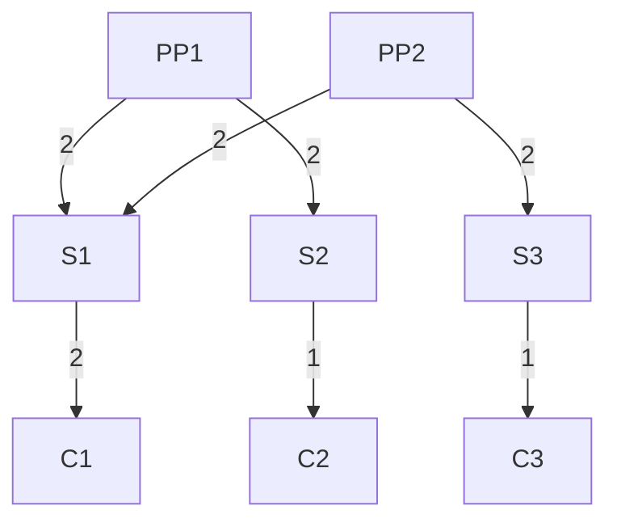
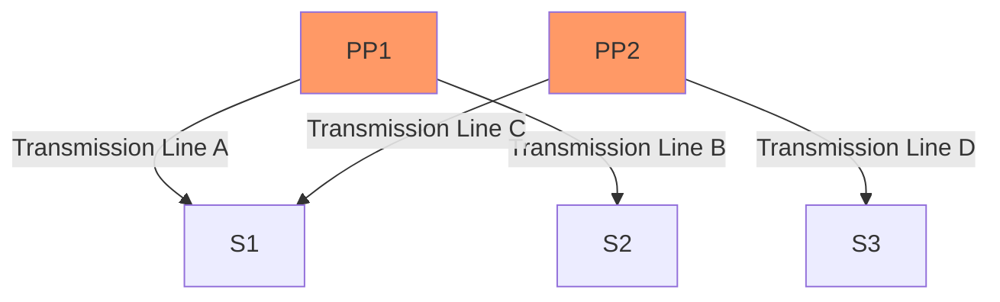
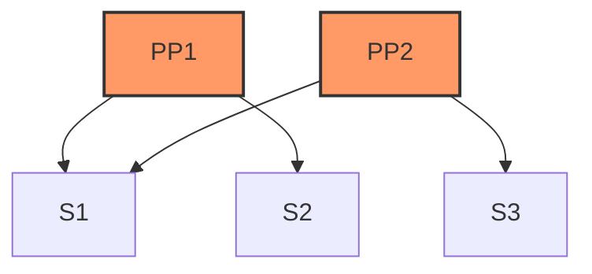
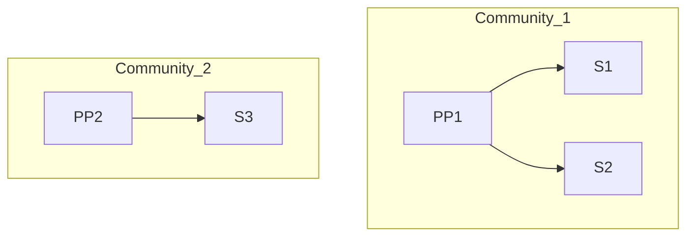
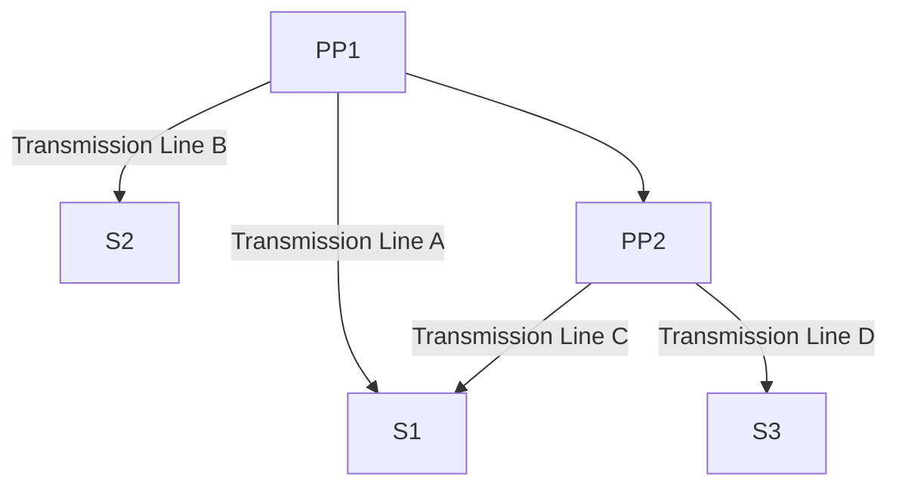
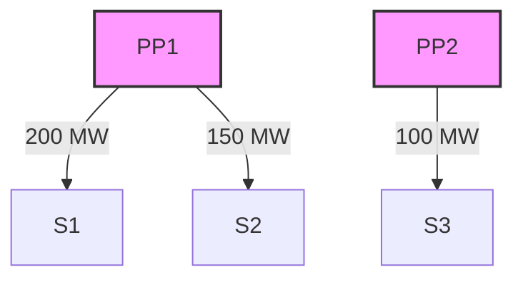

### Course Name: SYS520-Complexity Theory
### Instructor: Bobby Estey 
### Date: 07/08/2026

# Network Analysis Project: Power Utility Network

## Introduction

The complexity of modern power utility networks necessitates a thorough analysis to enhance operational efficiency, reliability, and responsiveness to consumer demand. This paper explores the structure, dynamics, and optimization of a power utility network using network theory. By modeling the system as a network of nodes and edges, we can analyze the flow of electricity, identify bottlenecks, and optimize performance.

### Objectives
- Understand the structural relationships within a power utility network.
- Analyze the flow of electricity from power plants to consumers.
- Identify critical nodes and paths to improve system efficiency.
- Use data-driven approaches for decision-making.

---

## Task 1: Prepare for the Network Analysis Project

### Understanding the System

A power utility network consists of several key components that work together to deliver electricity to consumers. The primary elements are power plants, substations, and consumers, all interconnected through transmission and distribution lines.

#### Components of the Network
- Power Plants: Generate electricity from various sources such as fossil fuels, nuclear, and renewable energy.
- Substations: Transform high-voltage electricity from transmission lines to lower voltages suitable for distribution.
- Consumers: End-users of electricity, including residential, commercial, and industrial sectors.

### Graphical Representation

---

## Task 2: Network Analysis

### Scenario Description

In this analysis, we aim to optimize the distribution of electricity within a power utility network. The primary challenges include minimizing energy losses during transmission, ensuring reliable supply to consumers, and maintaining system resilience against failures.

### Define the System

#### Components (Nodes)
- Power Plants (PP1, PP2): Provide the source of electricity.
- Substations (S1, S2, S3): Act as nodes that manage voltage transformation and distribution.
- Consumers (C1, C2, C3): Represent the end-users of the electricity supplied.

#### Relationships (Edges)
- Transmission Lines: High-voltage connections between power plants and substations.
- Distribution Lines: Lower-voltage connections between substations and consumers.

### Centrality Analysis

Centrality measures are essential for understanding the importance of various nodes in the network. We will examine degree centrality, betweenness centrality, and closeness centrality to identify critical nodes.

#### Degree Centrality

Degree centrality measures the number of direct connections a node has. Nodes with high degree centrality are critical for maintaining connectivity within the network.

#### Betweenness Centrality

Betweenness centrality assesses how often a node lies on the shortest path between other nodes. Nodes with high betweenness can control the flow of electricity and have significant influence over network performance.

#### Closeness Centrality

Closeness centrality measures how quickly a node can reach other nodes in the network. A node with high closeness centrality can efficiently communicate with many other nodes.

### Community Detection

Community detection helps identify clusters within the network where nodes interact more frequently. By understanding these clusters, we can optimize the operation of the power utility network.

### Shortest Path Analysis

Finding the most efficient route for electricity distribution is crucial for minimizing losses and ensuring reliability. We will use algorithms like Dijkstra’s to identify the shortest paths between nodes.

### Data Collection

In order to conduct a thorough analysis, it is essential to collect relevant data:

#### Parameters
- Connection Strengths: Capacity of transmission lines (measured in MW).
- Data Transfer Rates: Speed of communication for monitoring and control (measured in Mbps).
- Processing Times: Time required for energy distribution at nodes (measured in minutes).

---

## Flow Analysis

Analyzing the flow of electricity through the network is critical for identifying bottlenecks and optimizing overall performance. This involves assessing the capacity of each edge and the demand at each node.

### Flow Analysis Visualization

### Bottleneck Identification

Bottlenecks can occur when the demand at a consumer exceeds the supply capacity from the preceding nodes. Identifying these points is vital for maintaining reliability.

---

## Risk Analysis

Conducting a risk assessment of the power utility network involves identifying vulnerabilities and potential failure points:

### Risk Factors
1. Natural Disasters: Events like storms or earthquakes can disrupt transmission lines.
2. Equipment Failure: Aging infrastructure may lead to unexpected outages.
3. Cybersecurity Threats: Increasing reliance on technology exposes the network to cyberattacks.

### Mitigation Strategies
- Redundancy: Implementing backup systems or alternative routes for electricity flow.
- Regular Maintenance: Ensuring infrastructure is regularly inspected and updated.
- Real-Time Monitoring: Using smart grid technologies to detect and respond to issues promptly.

---

## Conclusion

This detailed analysis of a power utility network emphasizes the importance of understanding its structural dynamics and flow characteristics. By applying network theory, we can identify critical nodes, optimize electricity distribution, and enhance operational efficiency. The findings provide a solid foundation for further research and practical applications in the field of power utilities.

--- 

### References

Micouin, P. (2014). Model Based Systems Engineering: Fundamentals and Methods. ISTE Ltd : John Wiley & Sons, Inc. 

Electric Power Sector Basics | US EPA. (n.d.-b). https://www.epa.gov/power-sector/electric-power-sector-basics 

Why distribution substation is an essential component of Electrical Power Systems? (n.d.-c). https://www.energycentral.com/energy-management/post/why-distribution-substation-essential-component-electrical-power-systems-WhZjOEKXhlJgykv 
---

