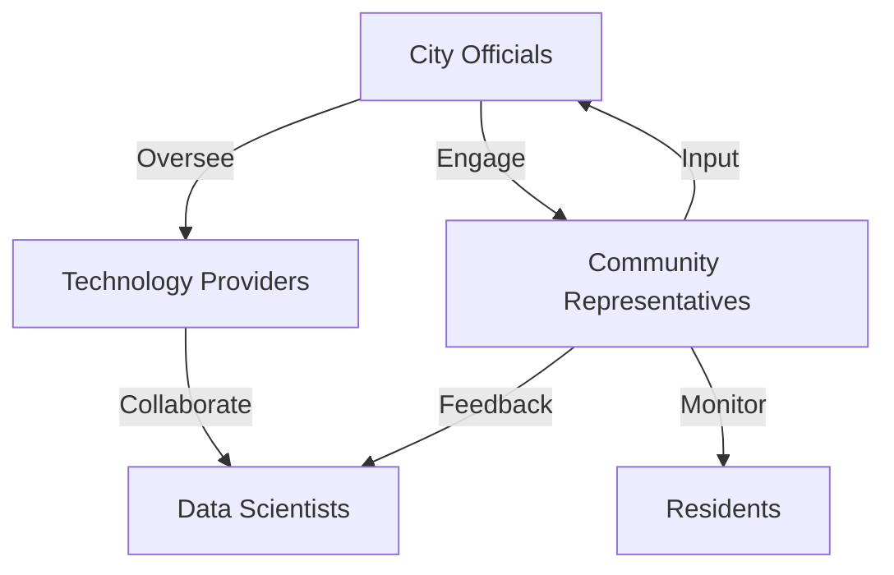
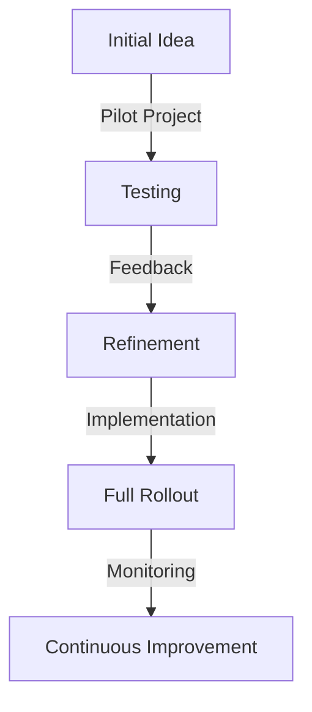

### Course Name: SYS520-Complexity Theory
### Instructor: Bobby Estey 
### Date: 07/22/2026

### Title: Navigating Complexity: Implementing a Smart City Initiative Using the Cynefin Framework

### Introduction

As urban populations swell globally, cities face a host of challenges, including traffic congestion, high energy consumption, and public safety concerns. The implementation of Smart City Initiatives aims to leverage technology to address these issues, ultimately enhancing the quality of life for residents. This paper explores a Smart City Initiative, categorizes it within the Cynefin Framework, and outlines a strategic decision-making process tailored to its complex nature. By doing so, it provides insights into how urban planners can navigate the intricacies of modern urban management.

### The Cynefin Framework: An Overview

The Cynefin Framework, developed by Dave Snowden, serves as a decision-making tool that categorizes problems into five distinct domains:

1. Simple: Problems that are easy to identify and solve, requiring best practices.
2. Complicated: Issues that may require expert analysis and involve multiple solutions.
3. Complex: Scenarios characterized by unpredictability, where solutions emerge through experimentation.
4. Chaotic: Situations requiring immediate action, where relationships are unclear.
5. Disorder: The state of not knowing which domain a problem resides in.

In this context, the complex domain is particularly relevant to the Smart City Initiative, as it involves numerous interconnected components and stakeholders.

### Project Overview: Smart City Initiative

#### Relevance and Significance

The Smart City Initiative encompasses a wide range of technology-driven solutions aimed at improving urban living conditions. Key components of the initiative include:

- Smart Traffic Management: Implementing adaptive traffic signals and real-time traffic monitoring systems to alleviate congestion and reduce travel time.
- Energy Efficiency: Utilizing Internet of Things (IoT) devices to optimize energy consumption in public buildings and street lighting, ultimately lowering municipal energy costs and environmental impact.
- Public Safety Enhancements: Integrating smart surveillance systems and data analytics to improve crime prevention and emergency response times.

The significance of the Smart City Initiative lies not only in its potential to address immediate urban challenges but also in its ability to foster sustainable development and enhance the overall livability of cities.

### Categorization of the Smart City Initiative within the Cynefin Framework

The Smart City Initiative fits squarely within the complex domain of the Cynefin Framework, due to several key factors:

- Multiple Interdependencies: The initiative involves a diverse array of stakeholders, including city officials, technology providers, community representatives, and residents. Each group has its own interests, goals, and levels of influence.
  
- Emergent Solutions: In a complex environment, solutions do not simply present themselves. Instead, they emerge through iterative processes of experimentation, where initial ideas are tested and refined over time. For instance, a pilot program for smart traffic signals may reveal unforeseen traffic patterns that require adjustments.

- Unpredictable Outcomes: The interactions between various technologies, public behaviors, and environmental factors introduce a level of unpredictability that is characteristic of complex systems. For example, the introduction of smart streetlights may change pedestrian behavior in ways that were not anticipated.

### Strategic Decision-Making Process for the Complex Domain

To effectively navigate the complexity of the Smart City Initiative, a tailored strategic decision-making process is essential. Below is a step-by-step approach:

1. Establish a Cross-Disciplinary Team
   - Composition: The success of the Smart City Initiative hinges on collaboration between various disciplines. The team should include urban planners, data scientists, engineers, community representatives, and policy experts.
   - Example: Engaging community leaders in the planning stages helps ensure that technology deployments meet the actual needs of residents, thereby fostering acceptance and minimizing resistance.

2. Conduct Rapid Prototyping
   - Implementation: Begin with pilot projects that allow for testing ideas on a small scale before full-scale implementation. This approach helps identify potential issues early on.
   - Example: Installing smart streetlights in a limited area can provide valuable data on energy savings and public sentiment, allowing for adjustments before a citywide rollout.

3. Utilize Agile Methodologies
   - Flexibility: Adopt agile practices that support iterative development and enable teams to respond quickly to changing conditions and feedback.
   - Example: Schedule regular review meetings to assess pilot results and make informed adjustments to the program based on real-time data.

4. Foster Open Communication Channels
   - Platforms for Dialogue: Create various communication platforms—both online and offline—to facilitate ongoing dialogue between all stakeholders.
   - Example: Organizing town hall meetings or setting up dedicated online forums can empower residents to share their experiences and concerns regarding new technologies.

5. Implement Feedback Loops
   - Data Analytics: Establish mechanisms to continuously monitor the effectiveness of implemented solutions and make necessary adjustments.
   - Example: Analyzing data from smart traffic systems can reveal trends that inform decisions about further refinements, such as adjusting signal timings.

6. Encourage a Culture of Experimentation
   - Learning from Failure: Foster a culture that encourages experimentation and views failures as learning opportunities.
   - Example: Documenting the outcomes of unsuccessful pilot initiatives can provide insights into what went wrong and how to improve future efforts.

---

### Cynefin Diagrams Using Mermaid Code

#### Stakeholder Interaction Diagram

The following diagram illustrates the interactions among key stakeholders involved in the Smart City Initiative:

#### Emergence Diagram

This diagram depicts the emergent nature of solutions within the Smart City Initiative:

### Challenges and the Role of the Cynefin Framework

#### Potential Challenges

1. Resistance to Change: Many community members may resist adopting new technologies due to fears about job displacement, privacy, or unfamiliarity with the systems. Overcoming this resistance is crucial for successful implementation.

2. Data Management: The integration of numerous smart technologies generates substantial amounts of data that require careful management and analysis. Ensuring data security and privacy is a significant challenge.

3. Funding and Budget Constraints: Securing sufficient funding for the initiative can be difficult, particularly in economically strained municipalities. Budget constraints may limit the scope of proposed technologies.

4. Technical Integration: The integration of various technologies from different vendors can lead to compatibility issues, requiring careful planning and execution.

#### Addressing Challenges with the Cynefin Framework

The Cynefin Framework provides a structured approach to navigate the complexities and challenges associated with the Smart City Initiative:

- Recognizing Complexity: By categorizing the initiative as complex, planners can adopt adaptive strategies that allow for flexibility and responsiveness to change.

- Engaging Stakeholders: Involving community members in the planning and implementation process can help mitigate resistance and foster a sense of ownership among residents.

- Iterative Learning: Emphasizing continuous improvement through feedback loops enables urban planners to refine and optimize solutions over time, addressing challenges as they arise.

### Conclusion

The Smart City Initiative exemplifies a complex project that can significantly enhance urban living. By categorizing it within the Cynefin Framework and employing a strategic decision-making process tailored to its complexities, urban planners can navigate the associated challenges effectively. The framework not only aids in understanding the nature of the initiative but also provides a roadmap for successful implementation, ensuring that the initiative meets its objectives while enhancing urban livability. The insights gained from this exploration can serve as a valuable guide for future projects in urban management.

### References
Cynefin framework (Snowden, 2010) | Download Scientific diagram. (n.d.-a). https://www.researchgate.net/figure/Cynefin-Framework-Snowden-2010_fig1_290179588 

